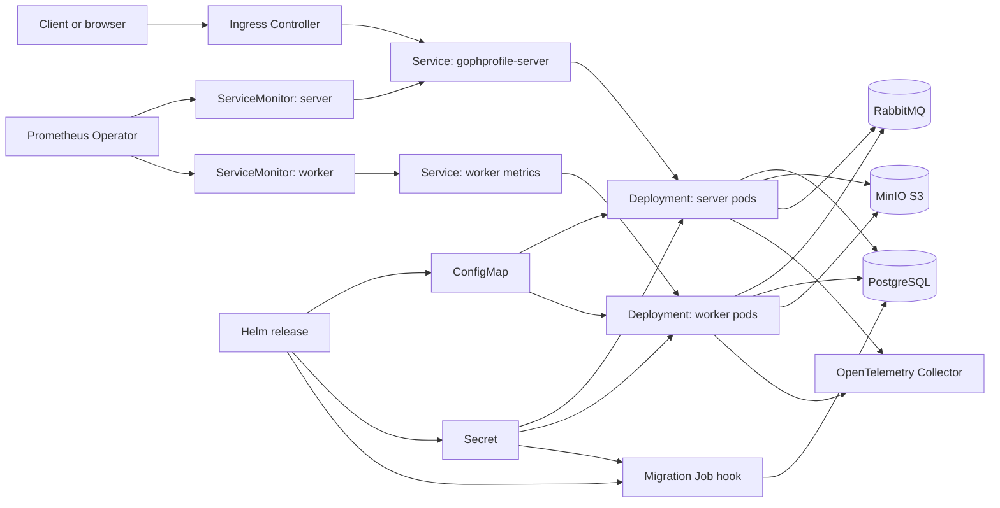

# GophProfile Kubernetes Architecture

## Components

- `server` handles HTTP API, web UI, `/live`, `/ready`, `/health`, and `/metrics`.
- `worker` consumes RabbitMQ avatar events and exposes Prometheus metrics on `:8081/metrics`.
- `ConfigMap` stores non-sensitive runtime configuration.
- `Secret` stores `DATABASE_URL`, S3 credentials, and `RABBITMQ_URL`.
- `HorizontalPodAutoscaler` scales server and worker deployments by CPU and memory.
- `ServiceMonitor` lets Prometheus Operator discover server and worker metrics.
- `NetworkPolicy` restricts ingress to ingress/monitoring namespaces and limits egress to infrastructure namespaces in production values.
- `pre-install,pre-upgrade` migration Job applies idempotent SQL migrations before production rollout. Local dev installs use `post-install` because the same chart creates PostgreSQL first.
- In-process circuit breakers protect PostgreSQL, MinIO, and RabbitMQ calls from repeated dependency failures.
- HTTP rate limiting is configured through `RATE_LIMIT_RPS` and `RATE_LIMIT_BURST`.
